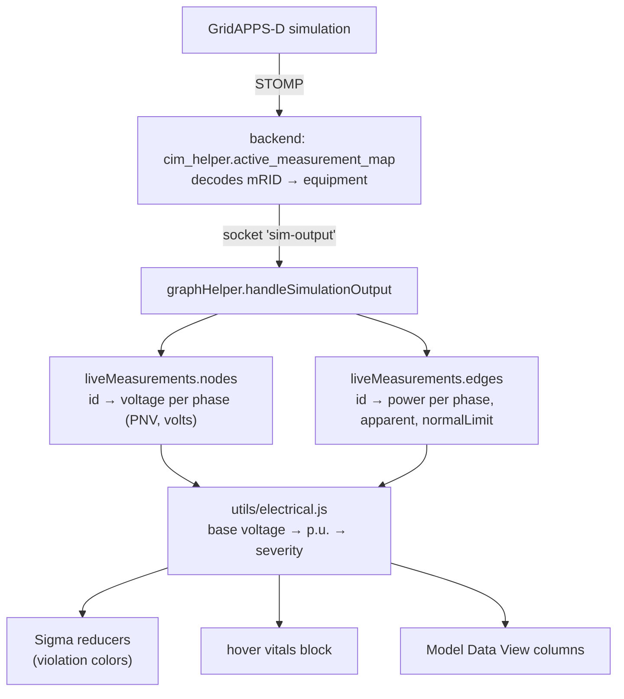

# Electrical Analysis: Violation Highlighting & Vitals Tooltips

Turns the live GridAPPS-D measurement stream into the two numbers an engineer
actually reads — **per-unit voltage** and **percent loading** — and surfaces them
in the graph, the hover cards, and the Model Data View.

Everything here is **read-only and ephemeral**. Nothing is written into a
model's own `attributes`, and it is all cleared when the simulation ends.

---

## What you see

| Where                            | What                                                                                                              |
| -------------------------------- | ----------------------------------------------------------------------------------------------------------------- |
| **Toolbar ⚠ button** (or `v`)    | Toggles _violation mode_. Enabled only while a simulation is `running` or `paused`.                               |
| **Graph, violation mode on**     | Nodes colored by voltage, edges by loading. Violating objects scale up ~2× and rise above their neighbours.       |
| **Condition legend** (top-right) | The color scale with a **live count per band**, so you can tell if anything is wrong without scanning the canvas. |
| **Node hover card**              | A bold, color-coded _vitals_ block — per-phase p.u. and volts — above the model attributes.                       |
| **Edge width & flow dots**       | Thickness and dot speed scale with loading, in _any_ mode — not just violation mode.                              |
| **Edge hover label**             | `Line670 · 78% loaded`                                                                                            |
| **Model Data View**              | Sortable `V (p.u.)` column (nodes) and `loading` column (edges).                                                  |

Violation mode **replaces** type coloring rather than blending with it — two
color scales at once would leave you unsure which one a given color belongs to.
Switch/regulator/transformer edges keep drawing their symbol, in the condition
color.

---

## Thresholds

Voltage follows **ANSI C84.1**; loading is a fraction of the element's normal
(continuous) rating. Both live in [`src/utils/electrical.js`](../src/utils/electrical.js)
as `VOLTAGE_LIMITS` and `LOADING_LIMITS` — change them there and the graph,
legend, tooltips, and tables all follow.

| Band                 | Condition                                                |
| -------------------- | -------------------------------------------------------- |
| Normal               | 0.95 – 1.05 p.u. (Range A)                               |
| Under / Over voltage | outside Range A, inside Range B (0.9167 – 1.0583)        |
| Severe under / over  | outside Range B                                          |
| Elevated loading     | ≥ 80% of ampere rating                                   |
| Overloaded           | ≥ 100% of ampere rating                                  |
| No data              | no measurement, no rating, or no resolvable base voltage |

Both severities are those of the **worst phase** — for voltage, the phase furthest
from nominal in either direction; for loading, the most heavily loaded
conductor. Ratings are per conductor, so an average would hide a single
overloaded phase.

---

## What happens in the background



### 1. Measurements land in an overlay

`handleSimulationOutput` keeps two maps on `graphHelper.liveMeasurements`:

```js
nodes: id -> { voltage: { A: { magnitude, angle }, ... } }              // PNV, volts
edges: id -> { power: { A: { real, imag, ... } }, apparent, normalLimit } // VA
```

`apparent` and `normalLimit` are **persisted on the overlay** so percent loading
can be computed anywhere, not just inside the tick handler. Each edge's total is
re-aggregated from its _full_ per-phase map rather than from the current
message batch — a tick may carry only a subset of an edge's phases, which would
otherwise understate the flow.

### 2. Two different denominators — don't confuse them

|                 | **Base voltage**                        | **Normal limit**                                  |
| --------------- | --------------------------------------- | ------------------------------------------------- |
| Applies to      | a node (bus)                            | an edge (line, transformer)                       |
| Answers         | "what voltage _should_ this bus be at?" | "how much can this conductor _carry_?"            |
| Units           | volts (line-to-neutral)                 | **amperes**                                       |
| Source          | node attribute, or inferred             | GridAPPS-D `GridLAB-D Limits` → `limits.currents` |
| Feeds           | `p.u. = V / V_base`                     | `loading = I / I_normal`                          |
| Violation means | equipment sees the wrong voltage        | conductor overheats                               |

They are independent — a line can be at 100% loading with perfect voltages, and
voltage can sag on a lightly-loaded long feeder.

Because the rating is in **amps** while the measurements are apparent power in
**VA**, loading needs a voltage to convert with:

```text
I_phase = S_phase / V_phase        both per-phase
loading = I_phase / normalLimit
```

`graphHelper` supplies that voltage from the measured PNV at either endpoint of
the edge, falling back to an endpoint's resolved base voltage. If neither is
available, power is shown but **no loading verdict is given** — dividing VA by
amps directly is dimensionally meaningless.

This is also why the PNV block in `handleSimulationOutput` runs _before_ the VA
block: the voltages must be in the overlay before any edge is evaluated.

### 3. Per-unit needs a base voltage — and that's the hard part

`magnitude / base` is trivial; getting `base` is not.

- **GridLAB-D** models carry `nominal_voltage` (line-to-neutral, matching PNV)
  directly on the node. Used as-is.
- **CIM / GridAPPS-D** models don't expose a numeric base: `cimhelper._add_attributes`
  stringifies `BaseVoltage` to its _name_, not its value.

So `resolveBaseVoltage()` is layered:

1. An explicit nameplate attribute (`nominal_voltage`, `base_voltage`, …).
2. Otherwise, snap the observed magnitude to the **nearest standard
   line-to-neutral distribution base** within ±10%.

The base is inferred from the node's **largest** phase reading, so a dead or
open phase can't drag the whole node down to a lower voltage class.

The hover card labels an inferred base as `(inferred)` so you always know which
source you're looking at.

### 4. Rendering

Violation mode is a flag on `graphHelper` (`isViolationMode()`), read directly
by the Sigma node/edge reducers in
[`GraphRenderer.jsx`](../src/components/graph/GraphRenderer.jsx) — so toggling it
recolors without rebuilding the graph. `setViolationMode` fires a
`graph-violation-mode-change` window event that the toolbar button and the
legend mirror, which is how the `v` shortcut and the button stay in sync.

Edge width and flow-dot speed are driven by the same loading ratio, via
`edgeWidthForLoading` / `dotSpeedForLoading`. Both use a **sqrt** response, not
linear: on a real feeder the trunk carries most of the load and the laterals run
lightly loaded, so a linear map bunches nearly every edge at the thin end. The
endpoints (`EDGE_WIDTH_MIN/MAX`, `DOT_SPEED_MIN/MAX`) are pinned by tests —
an uncalibrated multiplier here once collapsed every edge to a hairline.

Hover cards are canvas drawings, so there is no collapsible section. Instead
[`buildHoverAttributes`](../src/utils/hover-attributes.js) **filters** the dump —
identifiers, area IDs, `Location` and coordinates are dropped,
electrically-interesting fields sort first, the list caps at 8, and a
`+N more — see Model Data View` line closes it out.

Two rules keep the card from ever going blank:

- The omitted count includes **filtered-out** attributes, not just truncated
  ones, so the `+N more` hint always appears when something was dropped.
- If the filter leaves nothing at all, the card falls back to showing the
  object's identifier. A CIM `connectivity_node` carries only
  `id` / `name` / `feeder_id` / area fields / `x` / `y` — every one of which is
  hidden — so without this it rendered as an empty box.

---

## Known limitations

- **Deeply depressed buses can mis-resolve their base.** Adjacent distribution
  classes are only ~6% apart (12470Y/7200, 13200Y/7620, 13800Y/7970), so the
  snapper takes the _closest_ candidate rather than requiring an unambiguous
  one — demanding uniqueness rejected every reading in that band. A bus below
  roughly 0.9 p.u. of its true base can land nearer a lower class and read as
  healthy. This only affects models with no nameplate attribute; it is pinned by
  a test so the behavior stays deliberate.
- **Loading needs a rating _and_ a voltage.** `normal_limit` is in amperes, so
  converting the measured VA into current requires a phase voltage. Without
  either, the UI shows apparent power with a `no rating` / `no base voltage`
  note and classifies as _No data_ — never as "normal", which would imply a
  verdict that wasn't made.
- **The reference voltage may come from the far end.** Loading uses the measured
  PNV at whichever endpoint has one, so on a long, heavily-loaded span the
  derived current can be off by the voltage drop across it (typically a few
  percent).
- **Split-phase / triplex** uses the same ANSI bands as primary.
- Violation mode is turned off by `graphHelper.reset()`, since condition
  coloring is meaningless once measurements are cleared.

---

## Files

| File                                                                                                  | Role                                                                                                |
| ----------------------------------------------------------------------------------------------------- | --------------------------------------------------------------------------------------------------- |
| [`src/utils/electrical.js`](../src/utils/electrical.js)                                               | All the math: base resolution, p.u., loading, classification, formatting. Pure and dependency-free. |
| [`src/utils/hover-attributes.js`](../src/utils/hover-attributes.js)                                   | Which model attributes reach a hover card, and the omitted count. Pure and dependency-free.         |
| [`src/graph-helper/GraphHelper.js`](../src/graph-helper/GraphHelper.js)                               | Overlay storage, violation mode, `buildNodeVitals` / `buildEdgeVitals`, hover payloads.             |
| [`src/utils/canvas-utils.js`](../src/utils/canvas-utils.js)                                           | `drawHover` — renders the vitals block and separator rule.                                          |
| [`src/components/graph/GraphRenderer.jsx`](../src/components/graph/GraphRenderer.jsx)                 | Violation coloring in the Sigma reducers.                                                           |
| [`src/components/legend/ViolationLegend.jsx`](../src/components/legend/ViolationLegend.jsx)           | Color scale + live counts.                                                                          |
| [`src/components/model-data-view/ObjectTable.jsx`](../src/components/model-data-view/ObjectTable.jsx) | Sortable p.u. / loading columns.                                                                    |

Plain node, no framework — matching the `socket-testing/` convention. Between
them they cover base-voltage snapping (including the documented mis-snap), ANSI
classification boundaries, dead-phase handling, missing-rating behavior,
formatting, attribute ordering and truncation, and the empty-card regression.

Both suites earned their place by catching real bugs: the base snapper
originally resolved _nothing_ in the 7–8 kV band, and the hover filter rendered
CIM `connectivity_node` cards as empty boxes.
